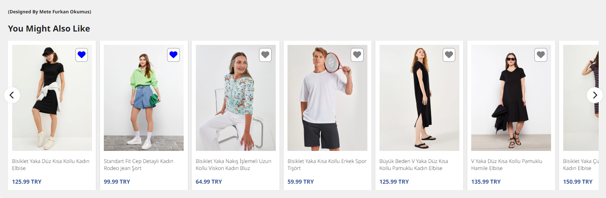

# lc-waikiki-product-carousel

# Proje Açıklaması

Bu proje, **Anında Çalışan Fonksiyon İfadesi** (Immediately Invoked Function Expression - IIFE) kullanılarak yazılmıştır.

## Kullanılan Teknolojiler

- **HTML**
- **CSS**
- **Pure JavaScript**
- **JQuery**

## Proje Detayları

Projede ürünler bir API üzerinden çekildi ve **localStorage**'a kaydedildi. Ürünler, altı ürün ve bir ürün yarısı gözükecek şekilde tasarlandı ve slider yapısı eklendi. Ürün üzerine tıklanıldığında, yeni bir sayfada ürün detay bilgilerine gidilmesi sağlandı. Ürün favori bilgisi de **localStorage**'a kaydedildi. Ürün favorilendiğinde ve sayfa yenilendiğinde, ilgili ürün ID'si **localStorage**'dan bulunarak eşleştirildi.
Böylelikle ilgili ürünün favorilenip favorilenmediğine göre ürün favori listesi güncellendi. 

